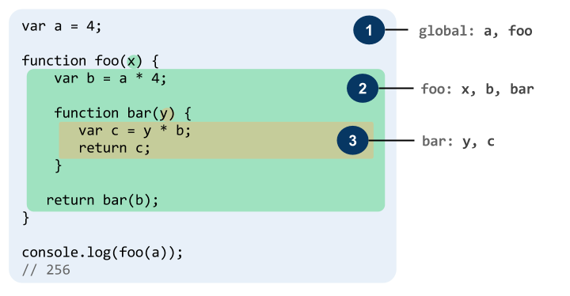

# Arrays
Any entries with Read More sections have optional arguments.
```
let arrayName = [];
```


- `arrayName.push(element)`: Adds an element to the end of an array [Read More](https://developer.mozilla.org/en-US/docs/Web/JavaScript/Reference/Global_Objects/Array/push)
- `arrayName.pop()`: Removes the last element from an array and returns that element. This method changes the length of the array.
- `arrayName.unshift(element)`: Adds one or more elements to the beginning of an array and returns the new length of the array. [Read More](adds one or more elements to the beginning of an array and returns the new length of the array. [Read More](https://developer.mozilla.org/en-US/docs/Web/JavaScript/Reference/Global_Objects/Array/unshift)
- `arrayName.shift()`: removes the first element from an array and returns that removed element. This method changes the length of the array.
- `arrayName.slice(start, stop)`: Access part of an array without modifying it. [Read More](https://developer.mozilla.org/en-US/docs/Web/JavaScript/Reference/Global_Objects/Array/slice)
- `arrayName.splice(start, numDeleting, item, ...)`: Changes the contents of an array by removing or replacing existing elements and/or adding new elements in place. [Read More](https://developer.mozilla.org/en-US/docs/Web/JavaScript/Reference/Global_Objects/Array/splice)
- `arrayName.indexOf(element)`: Returns the first index at which a given element can be found in the array, or -1 if it is not present. [Read More](https://developer.mozilla.org/en-US/docs/Web/JavaScript/Reference/Global_Objects/Array/indexOf)
- `arrayName.lastIndexOf(element)`: Returns the last index at which a given element can be found in the array, or -1 if it is not present. The array is searched backwards, starting at fromIndex. [Read More](https://developer.mozilla.org/en-US/docs/Web/JavaScript/Reference/Global_Objects/Array/lastIndexOf)
- `arrayName.includes(element)`: Determines if an array includes a certain value among its entries, returning true or false as appropriate. [Read More](https://developer.mozilla.org/en-US/docs/Web/JavaScript/Reference/Global_Objects/Array/includes)
- `arrayName.reverse()`: Reverses an array in place. The first array element becomes the last, and the last array element becomes the first.
- `arrayName.sort()`: Sorts the elements of an array in place and returns the sorted array. The default sort order is ascending, built upon converting the elements into strings, then comparing their sequences of UTF-16 code units values.
- `arrayName.forEach(function(element){...});`: Executes a provided function once for each array element. [Read More](https://developer.mozilla.org/en-US/docs/Web/JavaScript/Reference/Global_Objects/Array/forEach)

# Control Flow

# Scope

- `Global scope`: There's always a single global scope which lives at the top of the scope chain. Variables innitialized can be called from from anywhere.
- `Local/Function scope`: Every time a function runs, it creates its own scope. Variable innitialized here can be called only from inside the `{ }`where it was innitialized or within any `{}`'s contained within the original.
- `Block scope`: This scope is courtesy of ES2015's `let` & `const` keywords and in general, defines a scope within a code block defined using curly braces.



In the example above
- var a can be accessed anywhere.
- var b can be accessed by foo() and bar()
- var c can only be accessed by bar()

# Functions
## Different Types of Functions
Function Decloration
```js
function sayHello(name) { }
```
Function declorations can be called before the function is defined. 

Function Expression
```js
const sayHello = function(name){ };
```
Function Expressions need to be above any calls for the funtion in order for them to work. 

Arrow Function
```js
const add = (a, b) => a + b;

// The same but a Function Declaration
function add(a, b) {
  return a + b;
}
```
All arrow functions are Function Expressions. [Ream More](https://developer.mozilla.org/en-US/docs/Web/JavaScript/Reference/Functions/Arrow_functions)

`Paramaters` are the placeholders for inputs the function should recieve
`Arguments` are the specific values of the inputs we give the function when it's called. 


<br />
<br />

# Javascipt "Theory"
(For anyone actually using this I'll probably move this section to it's own thing eventually but for now I'm just going to leave this here.)


Functions in javascript are a callable objects

## Objects
Objects in javascript are like hashmaps and hashtables in other programming languages. 

Example of Ojbects:
- Arrays
- Objects 
- Function
- RegEx
- Date

## Const and Objects

We can change variabls and values within objects even if they are constant

When innitalizing an object as a const we can change the variables or data within the object without running into errors. This is because the object itself, when initialized, is refering to a pointer we created in the memory. This pointer lets the computer know where the other variables or data is but the actual value is still remaing constant. 


