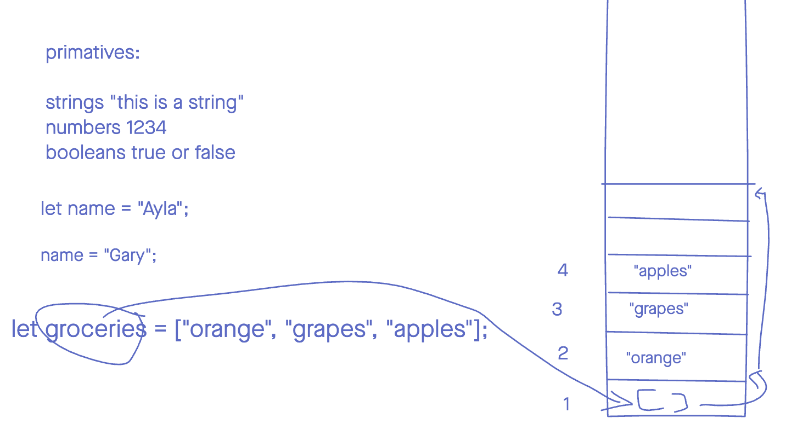

# Arrays
- `arrayName.push()`: Adds an element to the end of an array
- `arrayName.pop()`: Removes the last element in the array
- `arrayName.unshift()`: Adds an element to the beginning of an array
- `arrayName.shift()`: Removes the first element in the array
- `arrayName.slice(start, stop)`: Access part of an array without modifying it. [Read More](https://developer.mozilla.org/en-US/docs/Web/JavaScript/Reference/Global_Objects/Array/slice)
- `arrayName.splice(start, numDeleting, item, ...)`: Changes the contents of an array by removing or replacing existing elements and/or adding new elements in place. [Read More](https://developer.mozilla.org/en-US/docs/Web/JavaScript/Reference/Global_Objects/Array/splice)


# Functions
## Different Types of Functions
Function Decloration
```js
function sayHello(name){
	console.log('hello'+'!');
}
```
Function declorations are hoisted to the top of scope. Meaning it can be called anywhere in the code.

Function Expression
```js
const sayHello = function(name){
	console.log('hello'+'!');
};
```
Function Expressions need to be above any calls for the funtion in order for them to work. 

Arrow Function
```js
const add = (a, b) => a + b;

// The same but a Function Declaration
function add(a, b) {
  return a + b;
}

```

Functions in javascript are a callable objects

<br />
<br />

# Javascipt "Theory"
(For anyone actually using this I'll probably move this section to it's own thing eventually but for now I'm just going to leave this here.)


## Objects
Objects in javascript are like hashmaps and hashtables in other programming languages. 

Example of Ojbects:
- Arrays
- Objects 
- Function
- RegEx
- Date

## Const and Objects

We can change variabls and values within objects even if they are constant

When innitalizing an object as a const we can change the variables or data within the object without running into errors. This is because the object itself, when initialized, is refering to a pointer we created in the memory. This pointer lets the computer know where the other variables or data is but the actual value is still remaing constant. 


